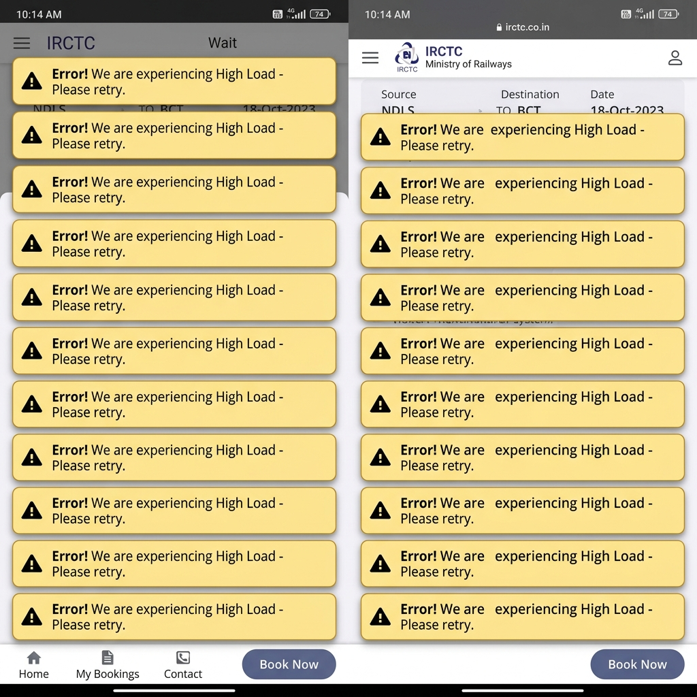

# Distributed Tatkal Booking Engine

A backend distributed system that simulates the **Tatkal railway booking rush** — where 10,000 users compete for 500 seats at exactly 11:00 AM.

Built to demonstrate concurrency control, service isolation, Redis atomic operations, and Kubernetes autoscaling through a deliberate **Monolith → Microservices** evolution.

---

## Why This Project Exists

At 11:00 AM every day, IRCTC opens Tatkal booking. Thousands of users simultaneously login, refresh availability, and attempt to book — creating a traffic spike 20× above normal load in under one second.

During a real Tatkal booking attempt, I encountered this:



> *Repeated "We are experiencing High Load - Please retry" errors during the Tatkal window. This project was built to understand and simulate the backend engineering challenges behind that failure.*

📄 [Full Case Study — Availability Refresh Storm](./docs/case-studies/Availability%20Refresh%20Storm%20Analysis.pdf)

---

## Core Engineering Problems

| # | Problem | What Breaks |
|---|---|---|
| 1 | **Double Booking** — TOCTOU race condition | Seats oversold, data corruption |
| 2 | **Auth CPU Spike** — bcrypt saturates event loop | Booking API starved in monolith |
| 3 | **Availability Refresh Storm** — read flood | MongoDB connection pool saturated |
| 4 | **Retry Storm** — duplicate booking requests | Ghost bookings, inventory corruption |
| 5 | **Service Isolation Failure** — shared process | One overloaded service crashes everything |

---

## Architecture Evolution

```
┌─────────────────────────────────────────────────────────────┐
│  Phase 1–3    Problem Analysis & Requirements               │
│  Phase 4–6    Monolith → Build → Load Test → Document       │
│               Failures                                      │
│  Phase 7–9    Service Boundaries → Microservice Design      │
│  Phase 10     Architecture Decision Records                 │
│  Phase 11–12  Docker → Kubernetes → HPA Autoscaling         │
│  Phase 13–14  k6 Load Testing → Benchmark Report            │
└─────────────────────────────────────────────────────────────┘
```

---

## Technology Stack

| Layer | Technology |
|---|---|
| Runtime | Node.js |
| Framework | Express.js |
| Database | MongoDB |
| Cache / Atomic Ops | Redis |
| Containerization | Docker |
| Orchestration | Kubernetes (Minikube) |
| Load Testing | k6 |

---

## Documentation Roadmap

> 📖 [Full Documentation Index →](./docs/README.md)

### 🟢 Foundation (Complete)

| Phase | Document | Description |
|---|---|---|
| 1 | [Problem Statement](./docs/phases/phase-01-problem-statement.md) | Business scenario, 5 core problems, real-world case study |
| 2 | [Requirements](./docs/phases/phase-02-requirements.md) | Architecture-driven FRs and NFRs, concurrency model |
| 3 | [Problems At Scale](./docs/phases/phase-03-problems-at-scale.md) | How each problem manifests technically under load |

### ⏳ Monolith (Coming Soon)

| Phase | Document | Description |
|---|---|---|
| 4 | Monolith Architecture | APIs, ER diagram, sequence diagrams |
| 5 | Monolith Implementation | Node.js + Express + MongoDB monolith |
| 6 | Monolith Failure Report | k6 load test results, bottleneck analysis |

### ⏳ Microservices (Coming Soon)

| Phase | Document | Description |
|---|---|---|
| 7 | Service Boundaries | How and why to split the monolith |
| 8 | Microservice Architecture | ER diagrams, sequence diagrams, API contracts |
| 9 | Architecture Decision Records | ADRs for every key technical decision |

### ⏳ Infrastructure (Coming Soon)

| Phase | Document | Description |
|---|---|---|
| 10 | Docker Architecture | Containerization, docker-compose |
| 11 | Kubernetes Deployment | Deployments, Services, Ingress, HPA |
| 12 | Autoscaling & HPA | CPU-based scaling demonstration |

### ⏳ Validation (Coming Soon)

| Phase | Document | Description |
|---|---|---|
| 13 | Load Testing Plan | k6 scripts, test scenarios |
| 14 | Benchmark Report | Monolith vs Microservice results |

---

## Key Engineering Decisions

- **Redis atomic `DECR`** prevents overselling — not MongoDB read-then-write
- **Stateless JWT** eliminates Auth as a runtime dependency for Booking
- **Idempotency keys** prevent ghost bookings from retry storms
- **Kubernetes HPA** scales services independently under load
- **Monolith-first** approach intentionally surfaces bottlenecks before solving them

---

## Repository Structure

```
distributed-tatkal-booking-engine/
├── README.md
├── docs/
│   ├── README.md              ← Documentation index
│   ├── phases/                ← All phase documents
│   ├── diagrams/              ← Architecture diagrams (Phase 4+)
│   ├── adr/                   ← Architecture Decision Records (Phase 9)
│   ├── benchmark/             ← Load test results (Phase 14)
│   └── case-studies/          ← Real-world observations
├── images/                    ← Screenshots and assets
├── prd/                       ← Original PRD
├── monolith/                  ← Monolith source code (Phase 5)
├── microservices/             ← Microservice source code (Phase 12)
├── k8s/                       ← Kubernetes manifests (Phase 11)
└── scripts/                   ← k6 load test scripts (Phase 13)
```

---

## What This Is / Is Not

| ✅ This IS | ❌ This is NOT |
|---|---|
| Backend architecture project | Frontend or UI project |
| Distributed systems learning project | Production IRCTC clone |
| Concurrency & scaling demonstration | Kafka / Event Sourcing project |
| Monolith → Microservices evolution | Full railway reservation system |

---

*This repository tells the story: Problem → Monolith → Failure → Microservices → Kubernetes → Autoscaling → Results*
