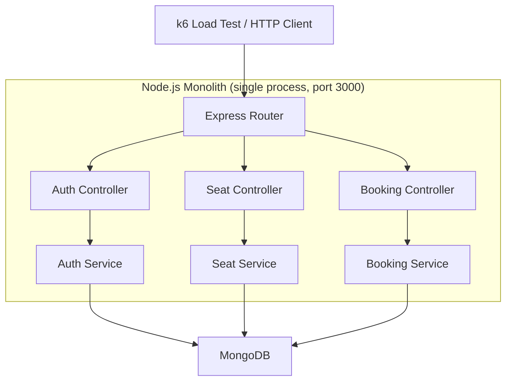
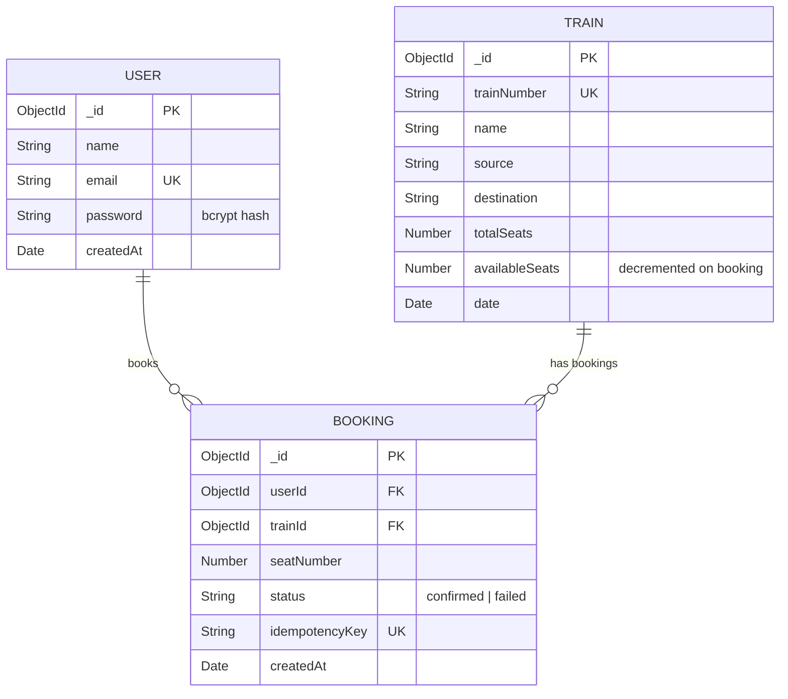
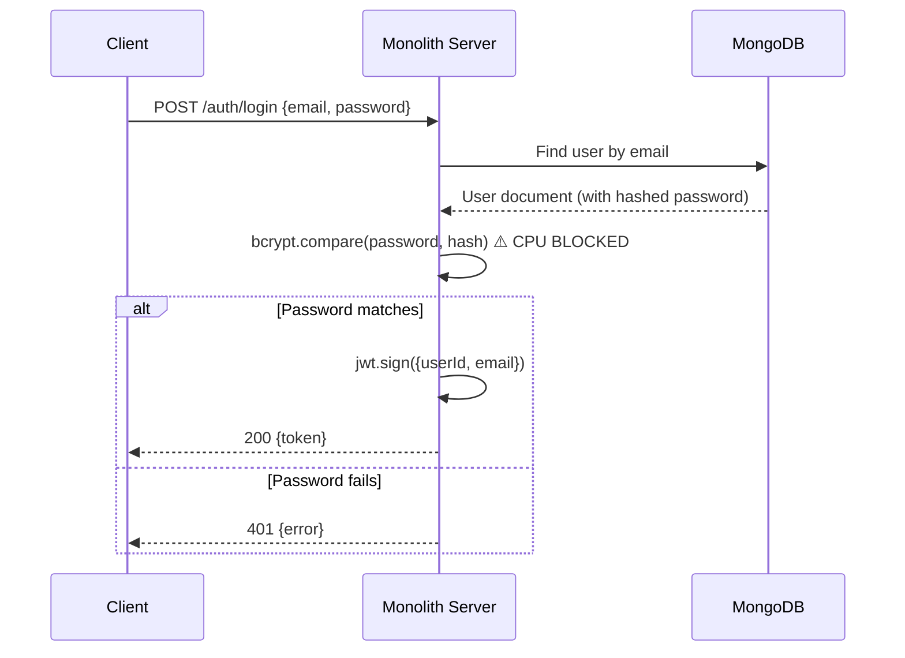
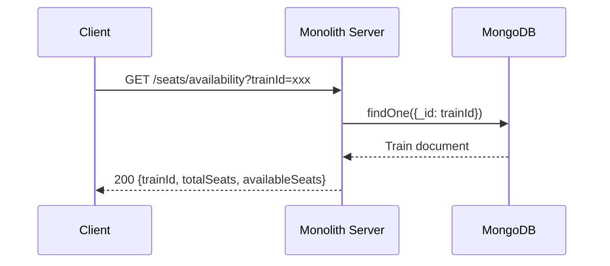
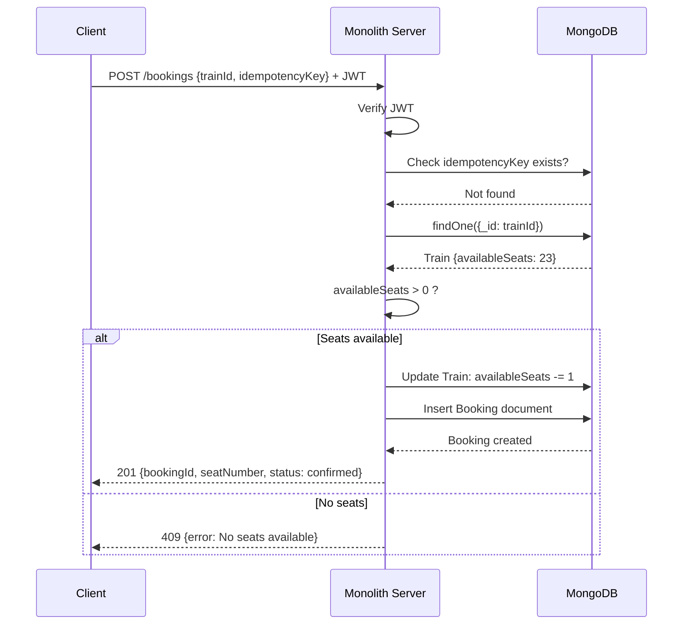
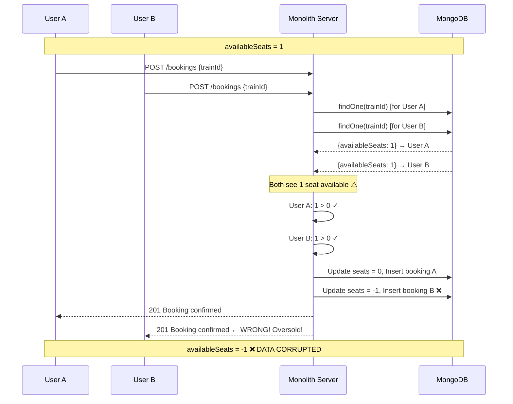

# Phase 4 — Monolith Architecture
### Distributed Tatkal Booking Engine

---

## Why This Phase Exists

Phase 3 explained *how* things break at scale. Phase 4 designs the system we will intentionally build **knowing it will fail**. This is not bad engineering — it is deliberate. We build the monolith to:

1. Have a working baseline to measure against
2. Create real, observable failures under load
3. Justify every microservice decision with evidence, not theory

> A monolith is not wrong. A monolith at the wrong scale is wrong. This phase builds the "wrong scale" version so we can prove it.

---

## Monolith Component Architecture

Everything runs in a **single Node.js process**, sharing one Express server, one event loop, one MongoDB connection pool.



### Why This Architecture Will Fail

| Shared Resource | Problem |
|---|---|
| **Single event loop** | bcrypt blocks all request processing |
| **Single port (3000)** | All traffic competes for the same socket |
| **Single MongoDB pool** | Auth reads, availability reads, and booking writes share connections |
| **Single process memory** | No isolation — one memory leak affects everything |
| **No independent scaling** | Cannot scale Auth separately from Booking |

---

## Project Structure (Monolith)

```
monolith/
├── src/
│   ├── app.js                 ← Express app setup + middleware
│   ├── server.js              ← Entry point — starts HTTP server
│   ├── config/
│   │   └── db.js              ← MongoDB connection
│   ├── models/
│   │   ├── User.js            ← Mongoose schema
│   │   ├── Train.js           ← Mongoose schema
│   │   └── Booking.js         ← Mongoose schema
│   ├── routes/
│   │   ├── auth.routes.js     ← POST /auth/login
│   │   ├── seat.routes.js     ← GET /seats/availability
│   │   └── booking.routes.js  ← POST /bookings
│   ├── controllers/
│   │   ├── auth.controller.js
│   │   ├── seat.controller.js
│   │   └── booking.controller.js
│   ├── services/
│   │   ├── auth.service.js    ← bcrypt + JWT logic
│   │   ├── seat.service.js    ← Availability query
│   │   └── booking.service.js ← Book seat + decrement
│   └── middleware/
│       └── auth.middleware.js ← JWT verification
├── scripts/
│   └── seed.js                ← Pre-seed users + train data
├── package.json
├── .env.example
└── Dockerfile
```

### Why This Structure

- **Routes → Controllers → Services → Models** is a standard layered pattern
- Each layer has one responsibility: routing, request handling, business logic, data access
- This same structure will later be **split into separate services** — the folder boundaries become service boundaries

---

## ER Diagram

Three collections in MongoDB. Intentionally simple — this is not a railway management system.



### Design Decisions

| Decision | Reason |
|---|---|
| `availableSeats` on Train document | Single source of truth in monolith — read + decrement in one place |
| `idempotencyKey` on Booking | Prevents duplicate bookings from retry storms |
| `seatNumber` assigned at booking time | Sequential: `totalSeats - availableSeats + 1` |
| `status` field | Allows failed booking attempts to be logged |
| No separate Seat collection | Not needed — we track count, not individual seats |

### What's Wrong With This ER in a Monolith

The `availableSeats` field on the Train document is the race condition source. Two concurrent reads of this field before either write creates the TOCTOU bug described in Phase 3.

---

## API Design

### POST `/auth/login`

Authenticates a user and returns a JWT.

| Field | Value |
|---|---|
| **Purpose** | Generate CPU-intensive bcrypt workload |
| **Auth** | None |
| **Request** | `{ "email": "user@test.com", "password": "pass123" }` |
| **Success (200)** | `{ "token": "eyJhbG..." }` |
| **Failure (401)** | `{ "error": "Invalid credentials" }` |

---

### GET `/seats/availability?trainId=xxx`

Returns current seat availability for a train.

| Field | Value |
|---|---|
| **Purpose** | High-frequency read — first bottleneck under load |
| **Auth** | None |
| **Request** | Query param: `trainId` |
| **Success (200)** | `{ "trainId": "xxx", "totalSeats": 500, "availableSeats": 342 }` |
| **Failure (404)** | `{ "error": "Train not found" }` |

---

### POST `/bookings`

Books a seat on a train. The critical transactional endpoint.

| Field | Value |
|---|---|
| **Purpose** | Atomic seat reservation — the core distributed systems problem |
| **Auth** | JWT required (Bearer token) |
| **Request** | `{ "trainId": "xxx", "idempotencyKey": "uuid-v4" }` |
| **Success (201)** | `{ "bookingId": "xxx", "seatNumber": 158, "status": "confirmed" }` |
| **Conflict (409)** | `{ "error": "No seats available" }` |
| **Duplicate (200)** | Returns original booking if idempotencyKey already exists |

---

## Sequence Diagrams

### Login Flow



> ⚠️ `bcrypt.compare` blocks the event loop for ~100ms per request. At 10,000 concurrent logins, this queues all other requests.

---

### Seat Availability Flow



> Under refresh storm (2,500 req/sec), every request hits MongoDB. Connection pool saturates. Reads start queuing behind booking writes.

---

### Booking Flow (Single User)



---

### Concurrent Booking Flow (THE RACE CONDITION)

This is the most important diagram. Two users booking simultaneously with 1 seat remaining.



> **This is the exact failure we will observe in Phase 6.** The monolith has no mechanism to prevent this — `findOne` and `updateOne` are two separate operations with no atomicity guarantee between them.

---

## What This Architecture Intentionally Does NOT Have

| Missing Feature | Why It's Missing | When It Gets Added |
|---|---|---|
| Redis | Monolith uses MongoDB for everything | Phase 8 (Microservices) |
| Atomic seat decrement | Using read-then-write (the bug) | Phase 8 (Redis DECR) |
| Service isolation | Single process = single failure domain | Phase 7 (Service Boundaries) |
| Horizontal scaling | Single instance only | Phase 11 (Kubernetes) |
| Connection pooling tuning | Default Mongoose settings | Never — not the lesson |

---

## Assumptions

- MongoDB runs locally or in Docker alongside the monolith
- Seed script creates 10,000 users and 1 train with 500 seats before load testing
- No rate limiting, no circuit breakers — we want the failures to be visible
- bcrypt salt rounds = 10 (standard, ~100ms per hash on typical hardware)

---
