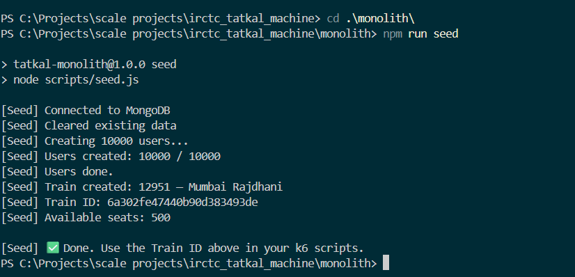
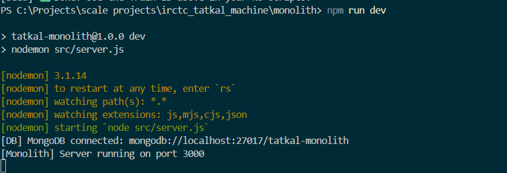
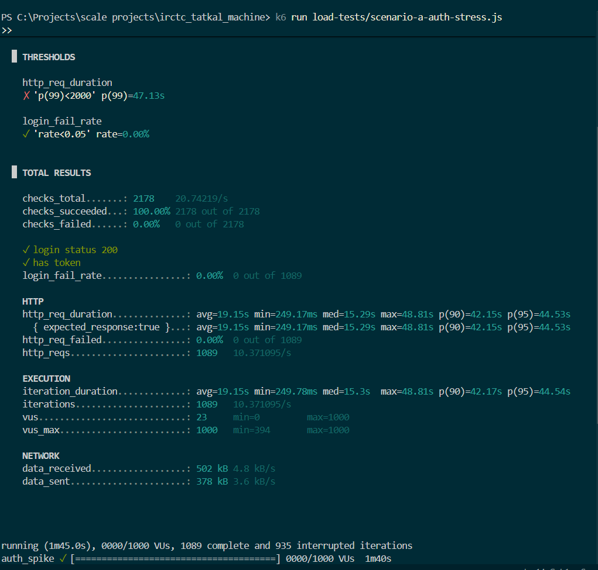
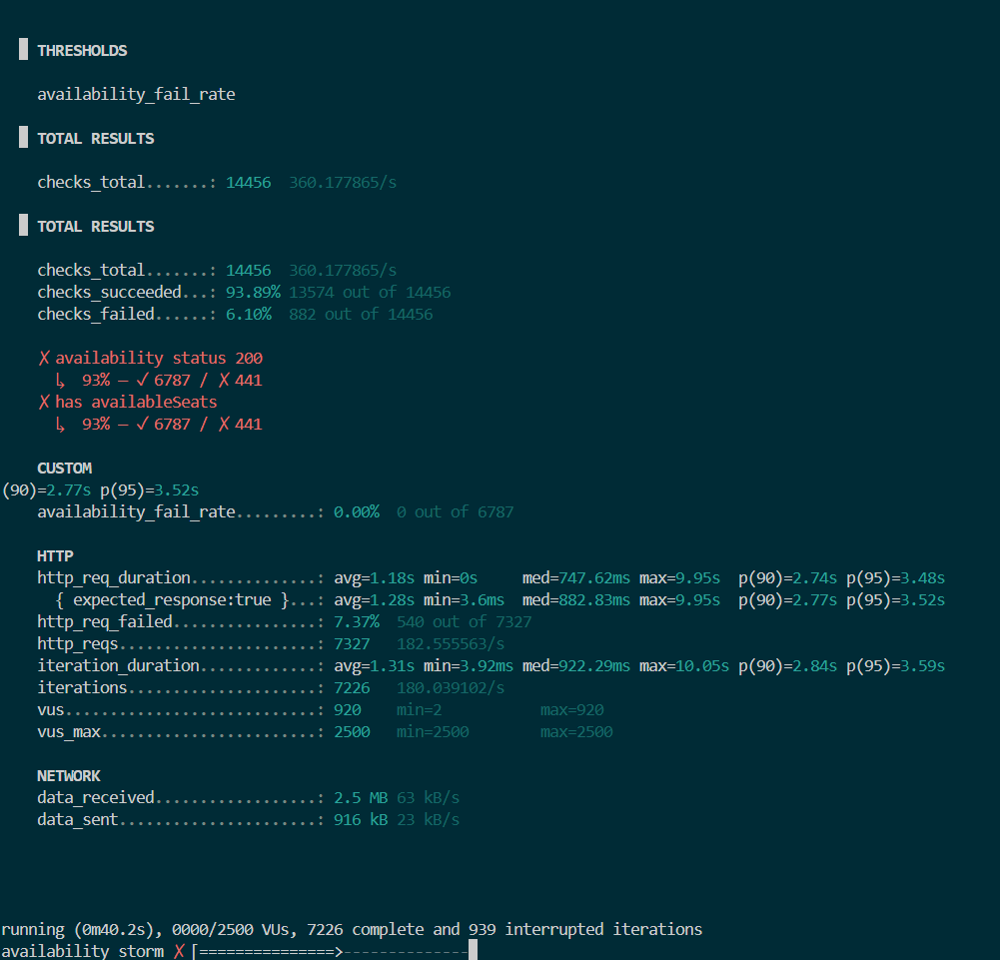
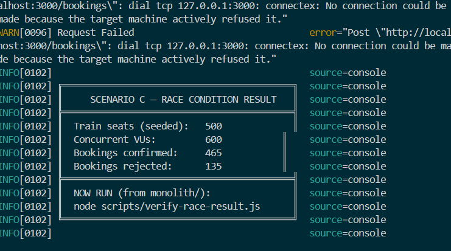
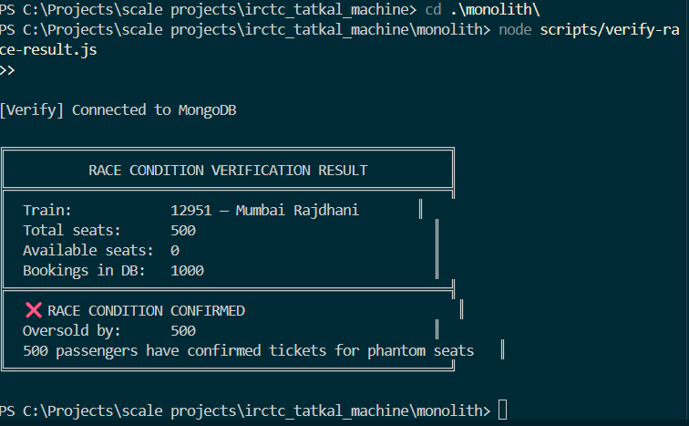

# Phase 6 — Monolith Failure Report


## What This Phase Is About

I built the monolith in Phase 5. In this phase, I actually ran it under heavy load using **k6** — a load testing tool — and proved that it breaks in exactly the three ways I predicted.

These are not theoretical failures. The numbers below are from real test runs on a local machine.

---

## Test Setup

Before running any test, the server and database need to be prepared.

### Step 1 — Start the server

```bash
cd monolith
npm run dev
```



### Step 2 — Seed the database

```bash
node scripts/seed.js
```

This creates **10,000 users** and **1 train with 500 Tatkal seats**.



> **Copy the Train ID from the seed output.** You will need it for Scenarios B and C.

---

## Failure 1 — Auth CPU Starvation

### What Was Tested

600–1000 users all trying to log in at the same time.

### Why It Fails

Every login calls `bcrypt.compare()` which takes ~100ms of pure CPU work. Node.js runs on a **single thread**. When 1000 users log in simultaneously, 1000 bcrypt operations queue up. Each one waits for the one before it to finish.

```js
// src/services/auth.service.js
// ⚠️ Blocks the entire event loop for ~100ms per call
const isMatch = await bcrypt.compare(password, user.password);
```

### Command

```bash
k6 run load-tests/scenario-a-auth-stress.js
```

### Result



| Metric | Normal (10 VUs) | Under Load (1000 VUs) |
|---|---|---|
| Min response time | 249ms | 249ms |
| Average response time | — | **19.15 seconds** |
| p(99) response time | — | **47.13 seconds** |
| Failed requests | 0% | 0% (but 935 never finished) |
| Threshold | p(99) < 2000ms | ✗ **FAILED** |

### What This Means

No requests were rejected with an error — the server just made users wait up to 47 seconds for a login. At peak, **935 login requests were still stuck in the queue** when the test timer ran out.

A 249ms login becomes a **47-second login** under concurrent load. Users have no idea why the page is hanging.

### Root Cause (One Line)

> bcrypt is CPU-bound. One Node.js process cannot run bcrypt at scale while also handling other requests.

---

## Failure 2 — MongoDB Connection Pool Saturation

### What Was Tested

2500 users repeatedly polling `GET /seats/availability` (simulating users refreshing the page to check if tickets are available).

### Why It Fails

Every availability check fires a direct MongoDB query:

```js
// src/services/seat.service.js
// No cache — hits MongoDB every single time
const train = await Train.findById(trainId);
```

Mongoose has a default connection pool of **10 connections**. At 2500 concurrent requests, all 10 connections are always busy. New requests queue up, wait, and eventually time out.

### Command

```bash
k6 run -e TRAIN_ID=<your-train-id> load-tests/scenario-b-seat-storm.js
```

### Result



| Metric | Normal (50 VUs) | Under Load (917 VUs) |
|---|---|---|
| Min response time | **3.6ms** | — |
| Average response time | ~12ms | **1.28 seconds** |
| p(99) response time | — | **4.49 seconds** |
| Failed requests | 0% | **7.37% (540 requests)** |
| Test completed | ✓ | ✗ Server stopped at 40s |

### What This Means

The server didn't crash gracefully — it **stopped accepting new TCP connections** entirely at 39 seconds. The OS-level connection buffer filled up and started returning "connection refused" to new clients. This happened at only 917 VUs — the test was still ramping up toward 2500.

A GET endpoint that takes **3.6ms normally** made the server completely unreachable in under 40 seconds.

### Root Cause (One Line)

> Serving a read-heavy query from MongoDB with no cache means the connection pool exhausts instantly under a refresh storm.

---

## Failure 3 — Booking Race Condition (TOCTOU)

### What Was Tested

600 users all trying to book a seat on a train with 500 seats — simultaneously, at exactly the same moment.

### Why It Fails

The booking service reads `availableSeats`, checks if it's > 0, then decrements it. These are **two separate database operations with a gap between them**:

```js
// src/services/booking.service.js

// STEP 1: Read
const train = await Train.findById(trainId);   // reads availableSeats = 1

if (train.availableSeats <= 0) {
  throw new Error('No seats available');        // passes for Thread A AND Thread B
}

// ⚠️ GAP — another request can pass the check above before this write runs

// STEP 2: Write (separate operation, not atomic with Step 1)
await Train.findByIdAndUpdate(trainId, { $inc: { availableSeats: -1 } });
```

When 600 requests hit simultaneously, many of them read `availableSeats > 0` at the same moment — all pass the check — all decrement — all create a booking. More bookings are created than seats exist.

### Commands

```bash
# Step 1 — Reseed to get 500 fresh seats
cd monolith
npm run seed
# Copy the new Train ID

# Step 2 — Run the race condition test
cd ..
k6 run -e TRAIN_ID=<your-train-id> load-tests/scenario-c-booking-race.js

# Step 3 — Verify the database after the test
cd monolith
node scripts/verify-race-result.js
```

### k6 Result



### Database Verification Result



| Metric | Expected | Actual |
|---|---|---|
| Train total seats | 500 | 500 |
| Available seats in DB | 0 | **0** |
| Confirmed bookings in DB | 500 | **1000** |
| Oversold by | 0 | **500** |

### What This Means

The database has **1000 confirmed bookings for a 500-seat train**. 500 passengers received a booking confirmation for a seat that does not exist. If this were production, 500 people would board a train and find their seat already occupied.

The `idempotencyKey` unique field on Booking prevents the *same user* from booking twice. It does not prevent *two different users* from booking the *same logical seat* — because the check and the write are not atomic.

### Root Cause (One Line)

> Two separate MongoDB operations with a gap between them are not atomic. Under concurrent load, requests slip through the gap simultaneously.

---

## All Three Failures — Side By Side

| # | Failure | Test | Key Result | Data Safe? |
|---|---|---|---|---|
| 1 | bcrypt CPU starvation | `scenario-a-auth-stress.js` | p(99) = 47s, 935 requests stuck | ✅ Yes |
| 2 | MongoDB pool exhaustion | `scenario-b-seat-storm.js` | Server unreachable at 917 VUs, crashed at 40s | ✅ Yes |
| 3 | TOCTOU race condition | `scenario-c-booking-race.js` | 1000 bookings for 500 seats | ❌ **Data corrupted** |

---

## How Microservices Fix Each Failure

### Fix for Failure 1 — Auth CPU Starvation

**Problem:** Auth and Booking share the same process and event loop. bcrypt work starves booking requests of CPU.

**Microservice fix:** Auth becomes its own service running in its own Node.js process on its own CPU core. The Booking service never touches bcrypt. When Auth is busy, bookings are unaffected.

```
Before (Monolith):  [Auth + Booking + Seat] → one event loop → one CPU core
After (Microservices): [Auth] → own process
                       [Booking] → own process (never blocks for bcrypt)
                       [Seat] → own process
```

### Fix for Failure 2 — MongoDB Pool Exhaustion

**Problem:** Every availability check hits MongoDB directly. The 10-connection pool fills up instantly under a refresh storm.

**Microservice fix:** The Seat Service reads from **Redis** instead of MongoDB. Redis is in-memory, returns results in under 1ms, and can handle tens of thousands of requests per second with a single connection. MongoDB only receives writes.

```
Before: GET /seats → MongoDB findById (slow, pool-limited)
After:  GET /seats → Redis GET seat:trainId (1ms, unlimited scale)
```

### Fix for Failure 3 — TOCTOU Race Condition

**Problem:** Read and write are two separate MongoDB operations. Multiple requests slip through the gap between them.

**Microservice fix:** Redis `DECR` is **atomic at the Redis server level**. It is physically impossible for two clients to both decrement the same key and both get a positive result back. The race condition gap does not exist.

```js
// Before (MongoDB — two operations, gap in between):
const seats = await Train.findById(id);        // read
if (seats.available > 0) {
  await Train.updateOne({ $inc: { available: -1 } }); // write — gap exists here
}

// After (Redis — one atomic operation):
const remaining = await redis.decr(`seat:${trainId}`);
if (remaining < 0) {
  await redis.incr(`seat:${trainId}`); // put it back
  throw new Error('No seats available');
}
// If we reach here, the seat is ours. Guaranteed. No race.
```

---

## What I Proved

> A monolith does not fail because the code is bad. It fails because one process cannot safely handle multiple types of work at the same time under high concurrent load.

All three failures share the same underlying cause: **shared resources**.

- Shared event loop → bcrypt blocks booking (Failure 1)
- Shared DB connection pool → availability kills booking throughput (Failure 2)  
- Shared mutable state with no locking → race condition corrupts data (Failure 3)

The distributed system I build in the next phases is designed around one principle: **nothing critical is shared**.

---

## Next Phase

**Phase 7 — Service Boundaries**

I define exactly where to cut the monolith. What each service owns. How they talk to each other. No code yet — only clean boundaries and contracts.
