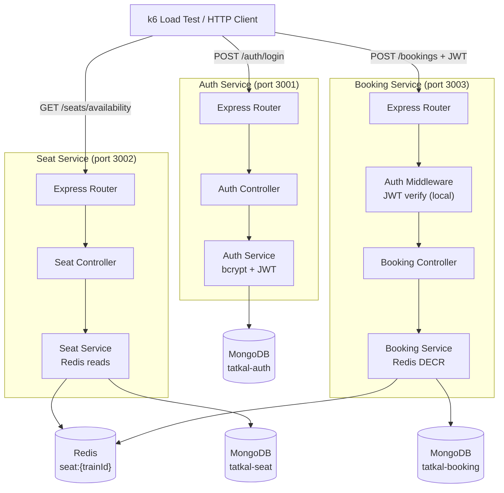
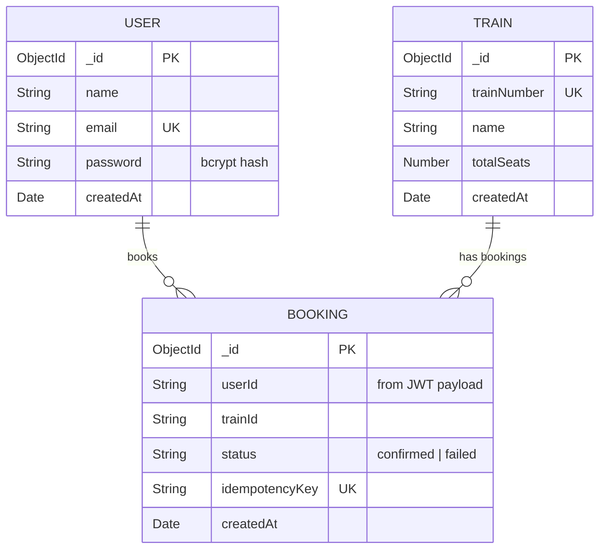
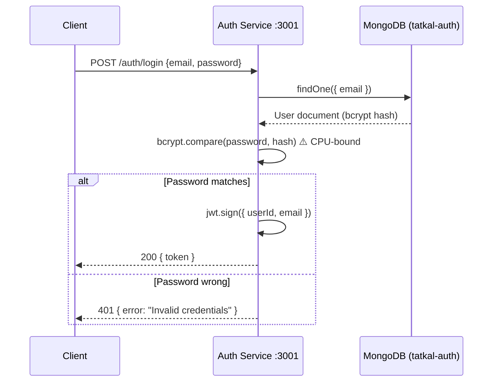
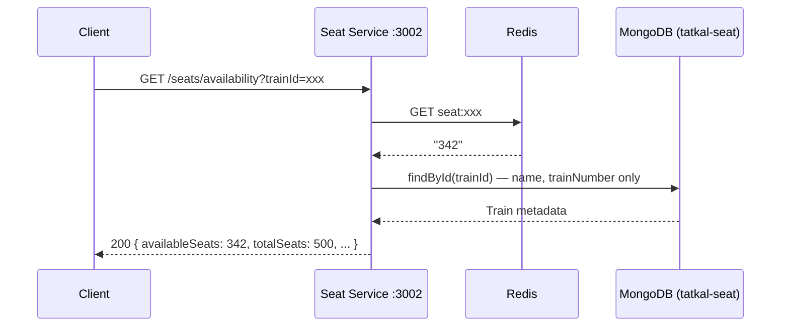
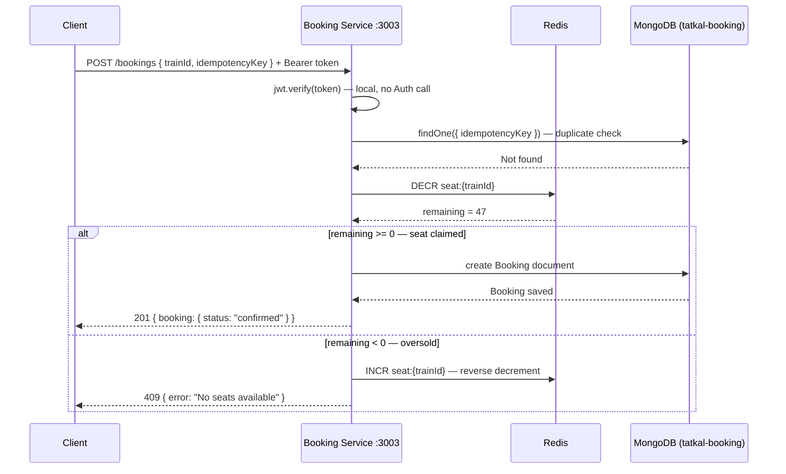
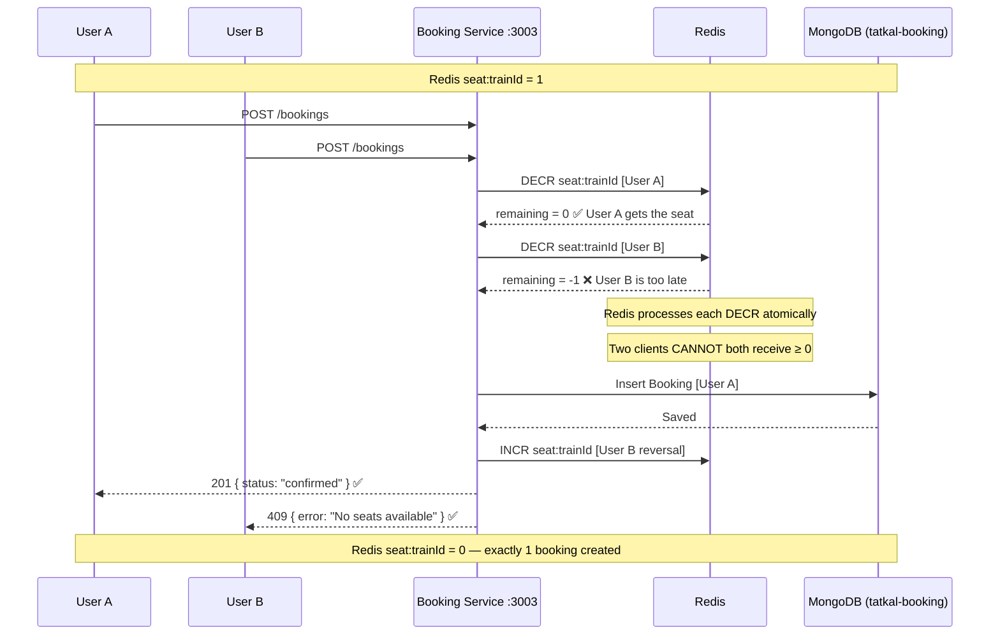

# Phase 8 — Microservice Architecture & Implementation


## Why This Phase Exists

Phase 6 proved three specific failures. Phase 7 defined the service boundaries. Phase 8 builds the solution.

Each microservice is designed to fix exactly one failure from Phase 6:

| Service | Fixes |
|---|---|
| **Auth Service** | bcrypt CPU starvation — isolated to its own process |
| **Seat Service** | MongoDB pool exhaustion — availability served from Redis |
| **Booking Service** | TOCTOU race condition — atomic Redis `DECR` replaces read-then-write |

---

## Microservice Component Architecture

Three independent Node.js processes. Each owns its data. No direct database cross-access.



### Why This Architecture Fixes the Monolith

| Problem (Monolith) | Fix (Microservices) |
|---|---|
| bcrypt blocks Booking event loop | Auth runs in its own process — CPU starvation is contained |
| All services share one MongoDB pool | Each service has its own connection pool |
| `findOne → updateOne` TOCTOU gap | Redis `DECR` is atomic — the gap cannot exist |
| One crash takes down everything | Each service fails independently |
| Cannot scale Auth without scaling Booking | Each service is deployed and scaled separately |

---

## Project Structure

```
microservices/
├── auth-service/              ← Port 3001
│   ├── package.json
│   ├── .env.example
│   ├── src/
│   │   ├── server.js          ← Express entry point
│   │   ├── config/
│   │   │   └── db.js          ← MongoDB connection (tatkal-auth)
│   │   ├── models/
│   │   │   └── User.js        ← Mongoose schema
│   │   ├── services/
│   │   │   └── auth.service.js ← bcrypt.compare + jwt.sign
│   │   ├── controllers/
│   │   │   └── auth.controller.js
│   │   └── routes/
│   │       └── auth.routes.js
│   └── scripts/
│       └── seed.js            ← Creates 10,000 test users
│
├── seat-service/              ← Port 3002
│   ├── package.json
│   ├── .env.example
│   └── src/
│       ├── server.js
│       ├── config/
│       │   ├── db.js          ← MongoDB connection (tatkal-seat)
│       │   └── redis.js       ← Redis client (reads only)
│       ├── models/
│       │   └── Train.js       ← Train metadata (no availableSeats!)
│       ├── services/
│       │   └── seat.service.js ← Redis GET for availability
│       ├── controllers/
│       │   └── seat.controller.js
│       └── routes/
│           └── seat.routes.js
│
└── booking-service/           ← Port 3003
    ├── package.json
    ├── .env.example
    └── src/
        ├── server.js
        ├── config/
        │   ├── db.js          ← MongoDB connection (tatkal-booking)
        │   └── redis.js       ← Redis client (DECR writes)
        ├── models/
        │   └── Booking.js     ← Booking records
        ├── middleware/
        │   └── auth.js        ← JWT verify (local — no Auth call)
        ├── services/
        │   └── booking.service.js ← Redis DECR + MongoDB write
        ├── controllers/
        │   └── booking.controller.js
        └── routes/
            └── booking.routes.js
```

---

## ER Diagram

Three separate MongoDB databases. `availableSeats` no longer lives in MongoDB — it moved to Redis.



> `seat:{trainId}` lives in **Redis**, not in the Train document. This is the key architectural change from the monolith.

### Design Decisions

| Decision | Reason |
|---|---|
| `availableSeats` removed from Train document | Moved to Redis for atomic `DECR` — MongoDB cannot do this safely |
| `userId` is a String (not ObjectId FK) | Booking Service has no access to Auth's database — uses userId from JWT payload |
| `trainId` is a String | Booking Service has no access to Seat's database — stored as plain reference |
| `idempotencyKey` unique index | Prevents duplicate bookings from network retries |
| Three separate databases | Data ownership enforced at infrastructure level, not just convention |

---

## API Design

### Auth Service — `POST /auth/login`

| Field | Value |
|---|---|
| **Port** | 3001 |
| **Auth** | None |
| **Request** | `{ "email": "user1@test.com", "password": "password123" }` |
| **Success (200)** | `{ "token": "eyJhbG..." }` |
| **Failure (401)** | `{ "error": "Invalid credentials" }` |

### Seat Service — `GET /seats/availability`

| Field | Value |
|---|---|
| **Port** | 3002 |
| **Auth** | None |
| **Request** | Query param: `?trainId=<id>` |
| **Success (200)** | `{ "trainId": "...", "trainNumber": "12951", "availableSeats": 342, "totalSeats": 500 }` |
| **Source** | Redis `GET seat:{trainId}` — never touches MongoDB for this read |

### Seat Service — `GET /seats/trains`

| Field | Value |
|---|---|
| **Port** | 3002 |
| **Auth** | None |
| **Success (200)** | `{ "trains": [ { trainId, trainNumber, name, availableSeats } ] }` |

### Booking Service — `POST /bookings`

| Field | Value |
|---|---|
| **Port** | 3003 |
| **Auth** | JWT required (Bearer token) |
| **Request** | `{ "trainId": "...", "idempotencyKey": "uuid-v4" }` |
| **Success (201)** | `{ "booking": { "_id": "...", "userId": "...", "trainId": "...", "status": "confirmed" } }` |
| **No Seats (409)** | `{ "error": "No seats available" }` |
| **Duplicate (201)** | Returns original booking if idempotencyKey was already used |

---

## Sequence Diagrams

### Login Flow



> ✅ bcrypt still blocks Auth's event loop — but Auth is now isolated. Booking Service (port 3003) is completely unaffected.

---

### Seat Availability Flow



> ✅ No MongoDB connection pool pressure from availability reads. Redis handles 100,000+ reads/sec without saturation.

---

### Booking Flow — Single User



---

### Concurrent Booking Flow — Race Condition SOLVED

Two users booking simultaneously with 1 seat remaining.



> ✅ The race condition is **structurally impossible** with Redis `DECR`. Unlike MongoDB's read-then-write, `DECR` is a single atomic operation at the Redis server level. No two clients can both see a positive remaining value for the same seat.

---

## Running All Services

### Prerequisites

- MongoDB running (default port 27017)
- Redis running (default port 6379)

```bash
# 1. Copy environment files
cp microservices/auth-service/.env.example    microservices/auth-service/.env
cp microservices/seat-service/.env.example    microservices/seat-service/.env
cp microservices/booking-service/.env.example microservices/booking-service/.env

# 2. Install dependencies
cd microservices/auth-service    && npm install
cd ../seat-service               && npm install
cd ../booking-service            && npm install

# 3. Seed the databases
cd auth-service  && node scripts/seed.js    # creates 10,000 users
cd ../seat-service && node scripts/seed.js  # creates 1 train + Redis counter

# 4. Start all services (3 terminals)
cd auth-service    && npm run dev           # → port 3001
cd seat-service    && npm run dev           # → port 3002
cd booking-service && npm run dev           # → port 3003
```

---

## What This Architecture Does NOT Have (Yet)

| Missing | Reason | Added In |
|---|---|---|
| API Gateway / reverse proxy | Not needed for local testing | Phase 10 (Docker) |
| Service discovery | Running locally on fixed ports | Phase 11 (Kubernetes) |
| Message queue / async events | Not required for this scope | Out of scope |
| Circuit breakers | Would complicate the failure demonstration | Acknowledged as gap |
| Distributed tracing | No Jaeger/Zipkin | Future improvement |

---

## Assumptions

- All three services run on the same machine for local development
- Redis and MongoDB are shared infrastructure (same instances, different databases)
- JWT secret is the same across Auth and Booking services (via identical `.env`)
- Seed scripts must be run in order: Auth first, then Seat
- No rate limiting — load tests need unrestricted access

---

##
